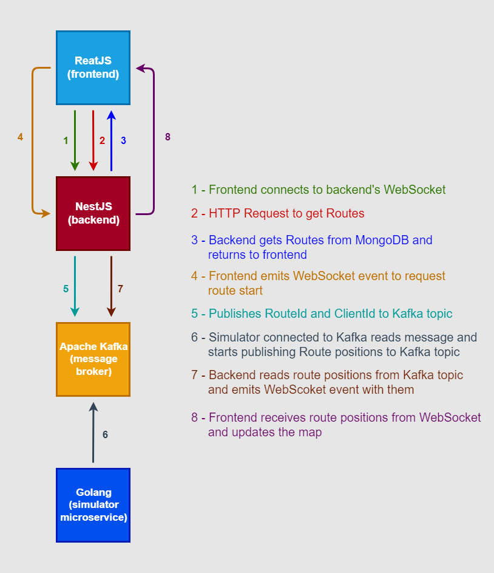
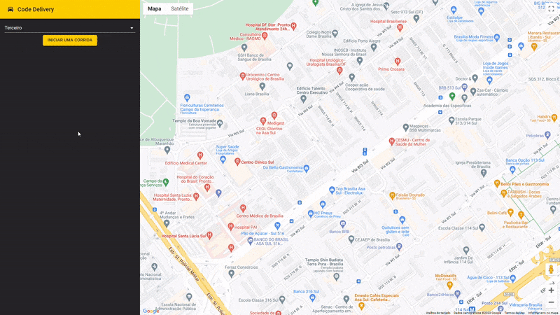

# Imersão Full Stack Full Cycle 8 - Codelivery

## Sobre o projeto
Projeto desenvolvido durante a oitava edição da Imersão Full Stack Ful Cycle, ocorrida em Junho de 2022.

O projeto consiste em um website que exibe o rastreamento em tempo real de um objeto (não foi definido o que seria, poderia ser um veículo efetuando serviços de logística, um veículo de um aplicativo de mobilidade urbana, etc) em movimento.

O objetivo da imersão é aprender uma forma de comunicação assíncrona para aplicações de grande porte, utilizando-se do Apache Kafka como grande aliado para a transmissão de informações entre micro-serviços.

## Fluxo arquitetural

## Ferramentas e tecnologias utilizadas
* Golang
* JavaScript
* TypeScript
* NestJS
* ReactJS
* WebSocket
* Docker
* MongoDB
* Apache Kafka
* Kafka Connect
* Kubernetes
* ElasticSearch
* Kibana

## Captura de tela

